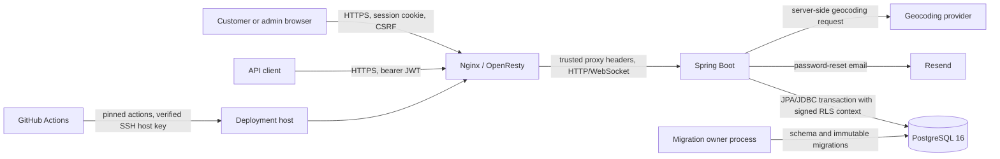

# Executive Summary

The audit reviewed the Spring Boot application, PostgreSQL 16 schema and RLS model, browser and JWT authentication, password recovery, customer and administrator authorization, ordering and pricing, STOMP/WebSockets, Nginx, Docker, CI/CD, dependencies, and repository history. Testing used disposable PostgreSQL databases with separate owner and runtime roles. Production inspection was limited to read-only HTTP requests and TLS/WebSocket handshakes.

Confirmed findings by severity: **0 Critical, 4 High, 9 Medium, 1 Low, and 1 Informational**. All application and database findings have code fixes and focused verification. Five findings remain externally blocked or need external verification: the exact production container image/runtime has not been inspected, the repository legacy proxy profile still needs deployment/config validation before use, the CI host-key secret has not been confirmed, and two historical credentials require provider-side rotation or rejection verification. Production now emits the reviewed CSP, Referrer-Policy, and Permissions-Policy headers. No SQL injection, cross-customer IDOR, stored XSS, CORS credential leak, public Actuator exposure, or WebSocket subscription bypass was confirmed.

Status as of 2026-09-29: the canonical audit report has been consolidated into this file. Locally executable non-database validation passed, but the PostgreSQL and browser regression suites could not be rerun in this shell because no disposable PostgreSQL test URL was configured. No deployment, provider credential rotation, CI secret update, production container inspection, destructive database action, or Git-history rewrite was performed.

# Architecture and Trust Boundaries



The browser is untrusted. Spring Security supplies the authenticated principal; request branch, customer, role, and pricing values are never authorization sources. The runtime database role has no ownership, role-membership, schema-creation, `BYPASSRLS`, superuser, `TRUNCATE`, or grant-option privileges. Each JPA transaction receives an HMAC-signed identity bound to its PostgreSQL backend and transaction ID. Catalog reads remain shared by design; customer, order, credential, recovery, and order-child data use forced RLS.

The configured environment administrator is a recovery identity with no customer ID. It can administer the system but cannot open customer order/profile routes or own orders. Named level-3 database accounts are customer-backed and retain customer ordering plus administrative authority.

# Attack Surface

| Classification | Externally reachable routes and destinations |
|---|---|
| Public | `GET /`, `/home`, `/menu`, `/menu/**`, `/login`, `/admin/login`, `/register`, `/forgot-password`, `/reset-password`; `POST /login`, `/register`, `/forgot-password`, `/reset-password`; `POST /api/auth/login`, `/api/auth/forgot-password`, `/api/auth/reset-password`; retired `POST /api/staff/login`; `GET /api/orders/menu`; `GET /api/branches/{branchId}/menu-items`; `GET /api/branches/{branchId}/pizzas`, `/pizzas/{pizzaId}`; quote endpoints under `/api/branches/**`; `GET /api/full-address`; static `/css/**`, `/js/**`, `/images/**`, `/webjars/**` |
| Authenticated customer | `GET /order`, `/checkout`, `/profile/edit`; `POST /profile/update`, `/api/orders`; STOMP `/user/queue/orders` |
| Staff | No PIN/code operational surface remains. Driver accounts have `ROLE_DRIVER` and no administrative or ordering routes. |
| Admin | `GET /admin`, `/admin/orders`, POS aliases `/input-orders`, `/orders`, `/InputOrders`, `/InputOrders.html`; branch-scoped pricing actions; `/api/admin/orders/**`, `/api/admin/customers/**`, customer notes and history; branch STOMP topic `/topic/admin/branches/{branchId}/orders` |
| Super Admin | Catalog/taxonomy mutation under `/admin/**`; `/api/admin/accounts`; access-level changes and account creation; `/api/admin/specials/**`; `POST /api/staff/create`; all-admin STOMP `/topic/admin/orders` |
| Internal | `/error`; owner migration profile and `app_security.*` functions; PostgreSQL and migration/provisioning services; `/actuator` requires authentication and exposes only the configured single endpoint |

All other HTTP requests require authentication. Method-specific Spring matchers place `POST /api/orders` before the admin-only `/api/orders/**` rule; customer-backed ordering is additionally enforced by `ROLE_USER` and controller identity resolution.

# Critical Findings

No Critical finding was confirmed.

# High Findings

## SA-001 — Forgable PostgreSQL RLS context

- **State:** CONFIRMED, RESOLVED
- **CWE / OWASP:** CWE-15; OWASP A01 Broken Access Control
- **Location:** `SQL files/rls-v1.sql`, `SQL files/rls-v3-hardening.sql`, `RlsContextInitializer`, `RlsRuntimeVerifier`
- **Attack scenario:** Any arbitrary-SQL path using the runtime role could set `app.role`, `app.customer_id`, and `app.branch_id` to impersonate a super administrator or another customer because the original policies trusted settings directly.
- **Impact:** Cross-customer reads/writes and global administrative database access if combined with SQL execution.
- **Evidence:** Safe PostgreSQL tests set forged, empty, malformed, stale-transaction, and cross-connection settings. Unsigned values now resolve to no actor and expose zero protected rows.
- **Remediation:** Added a secret stored outside runtime grants, HMAC signatures bound to customer/environment-admin subject, backend PID, and transaction ID, server-derived roles/branches, fixed `SECURITY DEFINER` search paths, explicit grants, and startup contract/fingerprint checks.
- **Verification:** `RlsPostgresIT` signed-context, single-connection isolation, `REQUIRES_NEW`, concurrent-request, policy-drift, grant-drift, and startup-rejection tests.

## SA-002 — Password changes did not invalidate active credentials and profile changes lacked current-password verification

- **State:** CONFIRMED, RESOLVED
- **CWE / OWASP:** CWE-613, CWE-620; OWASP A07 Identification and Authentication Failures
- **Location:** `CustomerController`, `PasswordResetService`, `AccountPrincipalRefreshFilter`, `JwtService`, `AccountWebSocketSessions`
- **Attack scenario:** A stolen session/JWT/WebSocket could remain useful after the owner changed or reset the password; a hijacked live session could set a new password without proving knowledge of the current password.
- **Impact:** Persistent account takeover and denial of account recovery.
- **Remediation:** Require the current password for profile password changes, rotate/invalidate the current session, fingerprint encoded credentials in sessions and JWTs, reject stale JWTs, and close affected WebSockets after password or access changes.
- **Verification:** `MultiLoginTest`, `PasswordResetServiceTest`, `ApiSecurityTest`, and `WebSocketConfigTest` cover current-password failure, successful invalidation, stale JWT rejection, reset single use, and session refresh.

## SA-011 — Google API key committed to Git history

- **State:** CONFIRMED, BLOCKED
- **CWE / OWASP:** CWE-798; OWASP A02 Cryptographic Failures
- **Location:** historical commit `a0261589d2ca05655bece669dac9e0ef9e4547ca` (secret value omitted)
- **Attack scenario:** Anyone with repository-history access can recover and abuse the credential. The locally configured key still matches the historical value.
- **Impact:** Third-party API abuse, billing exposure, and quota exhaustion depending on provider restrictions.
- **Remediation:** Current source uses environment injection. Rotate the key at the provider, restrict the replacement by API and server/referrer as appropriate, update deployment storage, and verify the old key is rejected. Decide separately whether to rewrite history.
- **Verification needed:** Provider-side rejection of the historical key and production functionality with the replacement.

## SA-012 — Database credential committed to Git history

- **State:** CONFIRMED EXPOSURE, BLOCKED FOR PROVIDER VERIFICATION
- **CWE / OWASP:** CWE-798; OWASP A02 Cryptographic Failures
- **Location:** historical commit `f09586283d22c500dca9c176a9ccf6c320463300` (credential omitted)
- **Attack scenario:** A repository reader can recover the historical database URL, owner username, and password.
- **Impact:** Database compromise if that historical endpoint or credential remains valid.
- **Evidence:** Current local database host and credential differ, but the former provider was not contacted during this audit.
- **Remediation:** Confirm deletion/rotation at the former provider and verify the old login is rejected. Current files contain environment placeholders only.
- **Verification needed:** Provider audit or a separately authorized authentication check against the former owned database.

# Medium Findings

## SA-003 — Recovery administrator was represented as a synthetic customer

- **State:** CONFIRMED, RESOLVED
- **CWE / OWASP:** CWE-862; OWASP A01 Broken Access Control
- **Location:** former environment-admin account bridge, `AccountPrincipal`, `SecurityConfig`, RLS v4
- **Attack scenario:** The environment recovery administrator could enter customer profile/order flows and create orders owned by a fabricated customer row.
- **Impact:** Incorrect ownership, audit ambiguity, and broader recovery-identity capability.
- **Remediation:** Removed the synthetic account/service, signed a customerless environment-admin marker for administrative database work, and require `ROLE_USER` for customer routes. Named level-3 accounts receive `ROLE_USER`; the environment administrator does not.
- **Verification:** PostgreSQL and regular tests prove named level-3 ordering/history, environment-admin 403 responses, and zero synthetic rows.

## SA-004 — Replayed or concurrent order submissions created duplicates

- **State:** CONFIRMED, RESOLVED
- **CWE / OWASP:** CWE-799; OWASP API6 Unrestricted Access to Sensitive Business Flows
- **Location:** `OrderController`, `OrderService`, `Order`, RLS v4, `checkout.js`
- **Attack scenario:** A client could replay a valid order request or issue simultaneous submissions despite browser button disabling.
- **Impact:** Duplicate kitchen orders and customer-service/financial reconciliation errors.
- **Remediation:** Require a bounded `Idempotency-Key`, scope a unique key to the authenticated customer, serialize concurrent keys with a PostgreSQL transaction advisory lock, and reuse the same browser key for retries.
- **Verification:** RLS integration tests submit sequential and concurrent duplicate requests and assert one order ID.

## SA-005 — Ambiguous account identifiers and registration enumeration

- **State:** CONFIRMED, RESOLVED
- **CWE / OWASP:** CWE-178, CWE-204; OWASP A07
- **Location:** `CustomerUserDetailsService`, account bootstrap functions, `CustomerController`, RLS v4
- **Attack scenario:** Case variants could create confusing duplicate email identities; secondary profile phones were accepted as login identifiers; distinct duplicate-email/phone messages disclosed registered identifiers.
- **Impact:** Account confusion and targeted credential attacks.
- **Remediation:** Normalize email case, add a case-insensitive unique index, authenticate only email or primary phone, and return a single generic registration conflict response including database-race conflicts.
- **Verification:** login/registration and PostgreSQL integration tests cover case variants, primary/secondary phone behavior, duplicates, and race-safe failure.

## SA-006 — High-risk paths lacked complete abuse and resource limits

- **State:** CONFIRMED, RESOLVED
- **CWE / OWASP:** CWE-307, CWE-770; OWASP API4 Unrestricted Resource Consumption
- **Location:** `AbuseProtectionFilter`, `SimpleRateLimiter`, request DTOs and server request-size configuration
- **Attack scenario:** Attackers could automate registration, reset, geocoding, quote, and order endpoints or grow the in-memory limiter with arbitrary identities. Large lists/strings/quantities increased database and CPU work.
- **Impact:** Email/API quota exhaustion, memory growth, noisy orders, and reduced availability.
- **Remediation:** Added proxy-aware per-client limits with deterministic 429/`Retry-After`, per-account reset limits, bounded limiter storage, 1 MB request caps, coordinate bounds, list/string bounds, and quantity maxima.
- **Verification:** `ApiSecurityTest` rate-limit tests, validation tests, and PostgreSQL suite.

## SA-007 — Known vulnerabilities in managed dependencies

- **State:** CONFIRMED, RESOLVED
- **CWE / OWASP:** CWE-1104; OWASP A06 Vulnerable and Outdated Components
- **Location:** `Misc/pom.xml`
- **Attack scenario:** The managed set included advisory-affected Jackson 2.21.4, Log4j API 2.24.3, Tomcat 10.1.55, and PostgreSQL JDBC 42.7.11. Tomcat container-authenticator advisories were not reachable because Spring Security handles authentication, while the JDBC/Jackson issues remained undesirable attack surface.
- **Impact:** Feature-dependent authentication, deserialization, logging, or TLS downgrade risk.
- **Remediation:** Overrode to patched Jackson 2.21.5, Log4j 2.25.5, Tomcat 10.1.58, and PostgreSQL JDBC 42.7.12 without a major framework upgrade.
- **Verification:** Maven dependency tree, OSV Scanner, and Trivy filesystem scan report zero application dependency vulnerabilities.

## SA-008 — Production lacked the new CSP, Referrer-Policy, and Permissions-Policy

- **State:** CONFIRMED, RESOLVED
- **CWE / OWASP:** CWE-693; OWASP A05 Security Misconfiguration
- **Location:** live `https://crowdcam.co.za`, `SecurityHeadersFilter`, Thymeleaf templates
- **Evidence:** Read-only production response on 2026-09-27 had HSTS, `nosniff`, and SAMEORIGIN but no CSP, Referrer-Policy, or Permissions-Policy. A read-only response check on 2026-09-29 returned nonce-based `Content-Security-Policy`, `Referrer-Policy: strict-origin-when-cross-origin`, and `Permissions-Policy: geolocation=(self), camera=(), microphone=(), payment=(), usb=()`.
- **Remediation:** Added per-response CSP nonces, removed inline event handlers, constrained connect/frame sources, and added Referrer/Permissions policies.
- **Verification:** `curl -D - https://crowdcam.co.za/` on 2026-09-29 confirmed the reviewed headers are live. Local template and JavaScript syntax validation also passed.

## SA-009 — Application container had excessive default privileges

- **State:** CONFIRMED, FIXED IN CODE, BLOCKED ON DEPLOYMENT
- **CWE / OWASP:** CWE-250; OWASP A05
- **Location:** `docker/Dockerfile`, `docker/docker-compose.yml`
- **Attack scenario:** A runtime compromise would execute as root in a writable container with default Linux capabilities.
- **Impact:** Increased container and host-adjacent impact.
- **Remediation:** Added a numeric non-root user, read-only root filesystem, dropped all capabilities, enabled no-new-privileges, bounded noexec tmpfs, excluded secrets/build debris, and added image/Compose health checks.
- **Verification needed:** Build and inspect the exact production image/container after deployment.

## SA-010 — CI trusted deployment host keys discovered at connection time

- **State:** CONFIRMED, FIXED IN CODE, BLOCKED ON CI SECRET CONFIGURATION
- **CWE / OWASP:** CWE-295; OWASP A08 Software and Data Integrity Failures
- **Location:** `.github/workflows/ci-cd.yml`
- **Attack scenario:** `ssh-keyscan` during deployment accepted whatever host key the network returned, enabling a first-connection man-in-the-middle deployment target substitution.
- **Impact:** Release artifact and deployment-secret compromise.
- **Remediation:** Require a pre-provisioned `AZURE_VM_KNOWN_HOSTS` secret, use restrictive file permissions, pin actions by commit, and clean local credentials.
- **Verification needed:** Configure the secret from an independently verified fingerprint and run CI.

## SA-014 — Error responses could display internal exception messages

- **State:** CONFIRMED, RESOLVED
- **CWE / OWASP:** CWE-209; OWASP A05
- **Location:** `CustomErrorController`, server error properties
- **Attack scenario:** A malformed or unexpected request could place framework/database exception text in the rendered error model.
- **Impact:** Internal implementation and schema information disclosure.
- **Remediation:** Render fixed messages, disable exception/message/binding/stacktrace inclusion, map missing resources to 404, and sanitize authorization failures.
- **Verification:** malformed-route, saved-destination, authorization, and template tests.

# Low Findings

## SA-013 — Proxy configuration accepted unsafe host/upgrade defaults

- **State:** CONFIRMED, FIXED IN CODE, BLOCKED ON DEPLOYMENT
- **CWE / OWASP:** CWE-346; OWASP A05
- **Location:** `docker/nginx/default.conf`
- **Attack scenario:** Host-derived redirects and unrestricted Upgrade forwarding increased host-header and proxy-protocol ambiguity; dotfiles and size/timeouts lacked explicit controls.
- **Impact:** Redirect poisoning or broader proxy behavior if the legacy proxy configuration is activated.
- **Remediation:** Fixed canonical redirects, reject unknown hosts, allow only the exact WebSocket upgrade token, restrict TLS to 1.2/1.3, hide versions, deny dotfiles, and bound request/proxy timeouts.
- **Verification needed:** Deploy the applicable proxy configuration and run `nginx -t` plus external host/WebSocket checks.

# Informational Findings

- Public menus, branch data, catalog items, and prices intentionally remain outside RLS and are runtime `SELECT` only. Startup checks validate that contract.
- No file upload/download feature or payment-card storage was found.
- Semgrep’s Django-CSRF findings are parser false positives for Thymeleaf; every identified state-changing form includes Spring’s CSRF token. Its custom-escaping warning was manually checked against the exact HTML contexts; the helper escapes all five HTML-sensitive characters.
- Semgrep still flags Nginx Upgrade forwarding, but the value is derived from an exact, case-insensitive `websocket` allowlist and all other values become empty/closed.
- Trivy's generic Dockerfile rule flags the Certbot helper's root identity. It is an isolated certificate-maintenance tool with no listener; Compose drops every capability, enables `no-new-privileges`, and limits writable locations to certificate volumes and bounded temporary filesystems. Running it as non-root would make existing root-owned certificate volumes unreadable without an infrastructure ownership migration, so this is a reviewed operational constraint rather than an open application vulnerability.

## SA-015 — Ignored local environment file contains live secret material

- **Finding ID:** SA-015
- **Descriptive title:** Ignored local environment file contains live secret material
- **Severity:** Informational
- **State:** CONFIRMED
- **CWE / OWASP:** CWE-522; OWASP A02 Cryptographic Failures
- **Exact affected files/classes/endpoints/components:** `SupportConfigFiles/.env` on the local workstation only. The file is ignored by `SupportConfigFiles/.gitignore` and excluded from container build context by `.dockerignore`.
- **Vulnerable code or behavior:** The repository workspace contains a developer/runtime `.env` file with database/application/API secret values. This is expected operationally, but a broad workspace archive, support bundle, backup, or accidental copy could expose live credentials even though the file is not tracked by Git.
- **Attack scenario:** An attacker who gains access to a developer machine, an unfiltered workspace zip, or an overbroad backup can read `SupportConfigFiles/.env` and attempt to use the recovered values against application, database, email, geocoding, JWT, or RLS-related services depending on which values are live.
- **Preconditions required for exploitation:** Access to the local filesystem or to an archive/backup that includes ignored files. The issue is not exploitable through the public web application based on the reviewed routing and production `/.env` check.
- **Security impact:** Possible credential reuse, provider abuse, database access, token forgery, or RLS-context forgery if the corresponding local values are production-valid and are not separately restricted.
- **Evidence used to confirm the issue:** `gitleaks dir . --redact` on 2026-09-29 reported five redacted findings in `SupportConfigFiles/.env` at lines 4, 18, 24, 31, and 36. `git ls-files --stage -- SupportConfigFiles/.env` returned no tracked entry, and `git check-ignore -v SupportConfigFiles/.env` showed the file is ignored by `SupportConfigFiles/.gitignore`.
- **Remediation implemented or recommended:** No source-code fix was needed because the file is already ignored and excluded from Docker build context. Keep this file local only, do not include ignored files in support bundles or repository archives, restrict filesystem permissions, prefer a password manager or platform secret store for production values, and rotate any value if the local file has been shared outside the trusted workstation.
- **Tests added:** None. This is an operational hygiene finding rather than an application behavior bug.
- **Verification performed:** Confirmed the file is ignored by Git and excluded by `.dockerignore`; production `https://crowdcam.co.za/.env` returned an authentication redirect rather than file contents.
- **Any remaining residual risk:** Secrets remain present on the local workstation by design. Rotation status and whether the values are production-valid require owner/provider verification.

# Attack Chains

1. **Arbitrary SQL → forged RLS identity → customer/admin data access (closed).** No reachable SQL injection was found, but the original database settings would have amplified any future SQL execution bug. Signed, transaction-bound settings now make that chain fail closed.
2. **Stolen session → change victim password → retain session/JWT/WebSocket (closed).** Current-password verification and credential fingerprints now terminate stale credentials.
3. **Registration enumeration → targeted credential stuffing/reset flooding (closed).** Generic conflict/reset responses, normalized identity, and client/account rate limits break the discovery and automation steps.
4. **Historical credential disclosure → third-party/database abuse (open).** Source cleanup cannot invalidate keys recoverable from Git history; provider rotation/rejection verification is still required.
5. **Application exploit → privileged writable container (code mitigated, deployment pending).** The reviewed container configuration limits user, capabilities, filesystem writes, and privilege escalation after rollout.
6. **Ignored local `.env` exposure → credential abuse (local operational risk).** Git and Docker ignore rules prevent ordinary source/build leakage, but workspace archives or backups that include ignored files could still expose live secrets.

# Authentication Review

Browser sessions and bearer JWTs were traced independently. Successful form login and post-registration login rotate the session; CSRF remains enabled for session writes. Public JSON authentication endpoints accept only JSON without CSRF because they do not consume ambient authentication. Invalid bearer credentials cannot fall back to an authenticated cookie session. Login failures are generic and rate-limited by the servlet-resolved client address.

Email authentication is case-normalized; primary phone is the only phone login alias. Passwords use Spring’s delegating encoder with BCrypt for stored customer credentials. The environment administrator is configured externally and has no customer identity. Saved destinations are restricted by portal and role. Logout invalidates the session through Spring Security.

# Authorization / IDOR Review

Backend route rules, method annotations, service branch checks, and RLS were reviewed together. Customer ownership comes from the authenticated account, never a body customer ID. Branch admins are restricted to their server-side level-to-branch mapping. Inaccessible RLS rows yield 404-style absence; rejected writes yield sanitized 403 responses. Order ownership, branch, child-parent links, account ID, role, and access-level mutations are guarded by policies/triggers.

Admin customer profiles and notes require an order linking that customer to the administrator’s branch. Access-level and global catalog/special mutations require super-admin authority. Drivers receive no operational permissions. Named super admins can order as themselves; the environment administrator cannot.

# PostgreSQL / RLS Review

Forced RLS covers customers, order headers and every current order-child table, staff credentials, password reset tokens, customer notes, and legacy orders when present. Child policies traverse actual foreign keys to the protected order header. Order policies do not query customer profiles, avoiding recursive policy evaluation.

Migrations execute only through the owner profile and are immutable by checksum. The runtime startup verifier checks role attributes/membership, ownership, schema/database privileges, forced RLS, policy/trigger/function definitions, table/function grants, shared catalog read-only grants, definer search paths, and the context-key fingerprint. Recovery functions expose only narrow results, registration forces level 0/USER, and reset consumption locks and invalidates tokens atomically.

The RLS trust boundary protects application queries under the application-supplied signed identity. Theft of the runtime credential plus arbitrary SQL cannot forge the HMAC context, but theft of both the runtime credential and `RLS_CONTEXT_SECRET`, compromise of the migration owner, or arbitrary code execution inside the application process remains outside that boundary.

# WebSocket Review

The HTTP authenticated principal is copied to messaging threads. Client SEND frames are denied. SUBSCRIBE permits only the authenticated customer user queue, the matching branch-admin topic, or the all-admin topic for super admins. Unknown destinations and anonymous subscriptions are denied. Account access and credential changes close matching live WebSocket sessions. Safe production probing showed an anonymous `/ws` handshake redirects to login.

# Business Logic Review

Order ownership and branch are derived server-side. Menu, pizza, special, modifier, extra, and delivery calculations resolve authoritative active catalog rows and server prices; client display totals are not persisted as authority. Unknown/archived/mismatched selections, invalid quantities, relationship reassignment, and unauthorized status changes are rejected. Order submission now requires a customer-scoped idempotency key and serializes concurrent retries.

# Infrastructure Review

The reviewed Docker configuration uses a non-root runtime, read-only filesystem, no Linux capabilities, no-new-privileges, a bounded temporary filesystem, no Docker socket, and no published application/database ports in Compose. PostgreSQL is reachable only on the Compose network. The deployment workflow pins third-party actions and requires a verified host-key secret.

Production currently uses OpenResty/Nginx Proxy Manager rather than the repository’s legacy Nginx service. Read-only checks on 2026-09-29 showed the live proxy rejects an untrusted SNI/host during TLS negotiation, while the repository proxy configuration still needs `nginx -t` and deployment validation before the legacy proxy profile is used.

# Dependency Review

Patched resolved versions are Jackson 2.21.5, Log4j API 2.25.5, Tomcat 10.1.60, and PostgreSQL JDBC 42.7.12. `npm audit` and OSV Scanner found no application/library vulnerabilities on 2026-09-29. Trivy could not be rerun in this shell because its vulnerability database download attempted to invoke a missing `docker-credential-desktop` helper; this is a local tooling blocker, not an application result. Maven plugins use fixed versions or the Spring parent’s managed versions. The obsolete Maven 3.8.4 and Nginx 1.27 bases were replaced by current official Maven 3.9.16 and Nginx stable Alpine bases. The PostgreSQL image is pinned to 16.15/Alpine 3.24. Scanner matches in its bundled `gosu` Go standard library were previously reviewed as not reachable through gosu's privilege-drop operation. The stable Certbot base's fixable OS/Python packages are upgraded in a dedicated pinned build. The exact production image must still be scanned and identified by OCI revision after deployment.

# Secrets Review

Current tracked sources contain environment placeholders rather than passwords/tokens. `.dockerignore` excludes local environment files. `gitleaks git --redact` on 2026-09-29 again found only the two already-documented historical credentials from SA-011 and SA-012; values and matches are intentionally omitted. `gitleaks dir --redact` also found current local secrets in ignored `SupportConfigFiles/.env`; this is tracked as SA-015. The Google key still requires provider-side rotation/rejection verification. The historical database host and password differ from current local configuration, but provider-side rejection remains unverified. Git-history rewriting was not performed.

# Production HTTP/TLS Review

Read-only checks on 2026-09-29 found: `/` returned 200 with nonce CSP, Referrer-Policy, Permissions-Policy, HSTS, `X-Content-Type-Options`, and SAMEORIGIN; `/actuator` and `/.env` redirected to login; an attacker-origin CORS preflight returned 403; an untrusted SNI/host failed TLS negotiation; TLS 1.1 was rejected before certificate exchange; TLS 1.2 and 1.3 succeeded. The Let’s Encrypt certificate was valid from 2026-09-21 through 2026-12-20.

# Fixes Implemented

- Signed and transaction-bound PostgreSQL RLS context with server-derived roles/branches.
- Expanded runtime startup verification and immutable RLS migrations.
- Customerless recovery administrator and corrected named-super-admin ordering authorities.
- Current-password verification and session/JWT/WebSocket credential invalidation.
- Canonical email identity, unambiguous login identifiers, and generic registration conflicts.
- Atomic reset consumption, reset flood controls, and sanitized reset logging.
- Customer-scoped order idempotency with concurrent replay serialization.
- Request, list, quantity, coordinate, and upload/body limits with deterministic rate limiting.
- Nonce CSP and browser security headers; removed inline event handlers; production header deployment verified on 2026-09-29.
- Generic error responses and secure cookie/forwarded-header behavior.
- Non-root/read-only/capability-dropped container and hardened proxy/CI configuration.
- Patched vulnerable dependency versions.

Major changed-file groups are:

- PostgreSQL enforcement: `SQL files/rls-v3-hardening.sql`, `SQL files/rls-v4-audit.sql`, `SQL files/provision-rls.sql`, `SupportConfigFiles/rls-contract.json`, and the RLS initializer/verifier classes.
- Authentication and authorization: the security configuration/principal/JWT/session filters, customer login/reset/profile services and controllers, and WebSocket session registry.
- Ordering and abuse controls: order DTO/entity/repository/service/controller, checkout JavaScript, quote DTOs/controllers, `AbuseProtectionFilter`, and `SimpleRateLimiter`.
- Browser/error hardening: `SecurityHeadersFilter`, `CustomErrorController`, Thymeleaf templates, and admin/checkout JavaScript.
- Supply chain/deployment: `Misc/pom.xml`, `.dockerignore`, Dockerfiles, Compose, Nginx, deployment/provision/test scripts, and the CI workflow.
- Evidence and regression coverage: PostgreSQL/security/customer tests, browser security tests, `MD files/Security audit.md`, and this report.

# Remaining Recommendations

These actions are required before the audit can be closed:

1. Rotate/restrict the historical Google API key, update deployment storage, and verify the old key is rejected.
2. Verify the former database credential is disabled at its provider.
3. Configure `AZURE_VM_KNOWN_HOSTS` from an independently verified server fingerprint.
4. Inspect the exact production image/container for non-root user, dropped capabilities, read-only root filesystem, OCI revision, and health.
5. Run the image scanner against the exact built production image and resolve any applicable findings.
6. Keep `SupportConfigFiles/.env` out of support bundles/backups, restrict local permissions, and rotate any values if the local file has been shared.
7. Make a separate explicit decision about Git-history rewriting after rotations. History rewriting is not a substitute for rotation.

# Security Test Coverage

The PostgreSQL integration profile covers two customers, both branch admins, a named super admin, environment recovery admin, driver, missing/empty/forged context, every protected child table, relationship reassignment, RLS grant/policy/trigger drift, registration/login/reset, JWT and session invalidation, one-connection reuse, commits/rollbacks/initialization failure, joined and `REQUIRES_NEW` transactions, concurrency, replay, startup rejection, and fresh/rerun migrations.

Browser tests cover public/customer/admin navigation, renderer XSS safety, CSRF/login behavior, POS queues, catalog filtering, specials, and ordering. Static validation checks JavaScript, inline template scripts, shell, SQL through migration execution, YAML, and Docker/Nginx configuration where tooling is available.

Final full-suite results from 2026-09-28 remain the last successful PostgreSQL/browser regression evidence: the full Maven PostgreSQL profile passed 192 unit/integration tests and 19 dedicated RLS tests; Playwright passed five scenarios. On 2026-09-29, embedded-template JavaScript validation, static JavaScript syntax checks, shell syntax checks, and `npm audit --audit-level=low` passed. A direct `./scripts/test-postgres.sh -B -Dtest=ApiSecurityTest,MultiLoginTest,RlsPostgresIT test -Prls-it` rerun was blocked because `RLS_TEST_ADMIN_URL` was not configured in this shell; plain Maven test was also blocked by unresolved `${TEST_DATASOURCE_URL}`. Browser regression tests were not rerun because they depend on the same disposable PostgreSQL harness. OSV reported zero vulnerability entries but exited non-zero after enrichment; Semgrep reported 19 previously triaged findings; Trivy could not update its DB because the local credential helper `docker-credential-desktop` is missing.

# Commands Used

```text
./scripts/test-postgres.sh -B -Dtest=ApiSecurityTest,MultiLoginTest,RlsPostgresIT test -Prls-it
./scripts/test-postgres.sh -B clean verify -Prls-it
npm --prefix SupportConfigFiles run test:browser
python3 scripts/check-template-scripts.py
node --check <JavaScript files>
bash -n <shell scripts>
gitleaks git --report-format json --report-path <sanitized temporary path>
osv-scanner scan source -r . --format json
semgrep scan --config auto --json .
trivy fs --scanners vuln,misconfig,secret .
npm --prefix SupportConfigFiles audit --audit-level=low
curl/openssl read-only production HTTP, CORS, Host, WebSocket, certificate, and TLS checks
2026-09-29: python3 scripts/check-template-scripts.py
2026-09-29: find src/main/resources/static/js -name '*.js' -print0 | xargs -0 -n1 node --check
2026-09-29: find scripts -name '*.sh' -print0 | xargs -0 -n1 bash -n
2026-09-29: npm --prefix SupportConfigFiles audit --audit-level=low
2026-09-29: gitleaks dir . --redact --report-format json --report-path <temporary path>
2026-09-29: gitleaks git . --redact --report-format json --report-path <temporary path>
2026-09-29: osv-scanner scan source -r . --format json
2026-09-29: semgrep scan --config auto --json .
2026-09-29: trivy fs --scanners vuln,misconfig,secret --format json --timeout 5m . (blocked by missing local Docker credential helper)
2026-09-29: ./scripts/test-postgres.sh -B -Dtest=ApiSecurityTest,MultiLoginTest,RlsPostgresIT test -Prls-it (blocked by missing RLS_TEST_ADMIN_URL)
2026-09-29: curl/openssl read-only production HTTP, CORS, Host/SNI, certificate, and TLS checks
```

Scanner output is stored only in temporary local files and was manually validated. Secret values are excluded from this report.

# Final Risk Summary

Application-layer residual risk is substantially reduced, and the last complete PostgreSQL security suite passed. Production now shows the reviewed browser security headers and low-impact HTTP/TLS checks remain favorable. Historical credentials, local secret hygiene, CI host-key verification, production container inspection, and image scanning keep the overall risk at **High** until rotations and rollout/provider checks are completed. After those actions, the remaining expected risk is ordinary operational risk around application-host compromise, migration-owner compromise, dependency drift, local secret handling, and third-party service availability.
